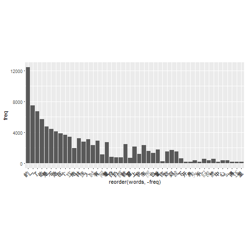
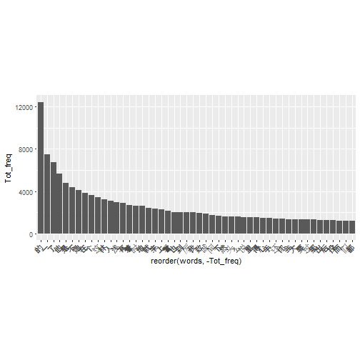
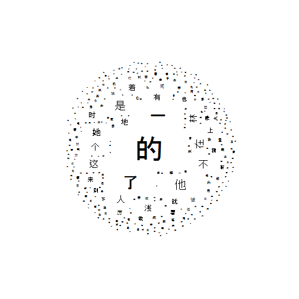
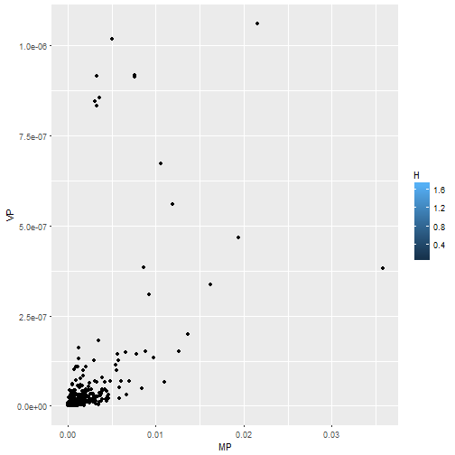
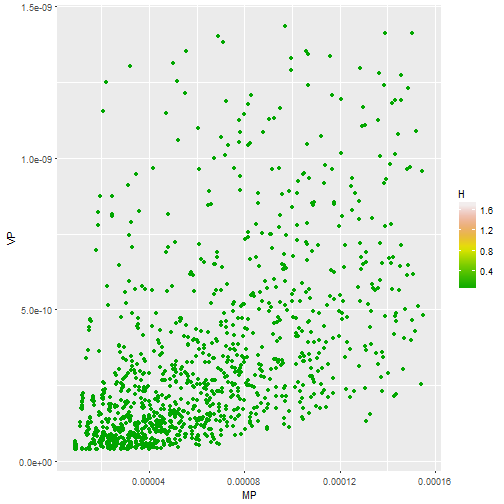
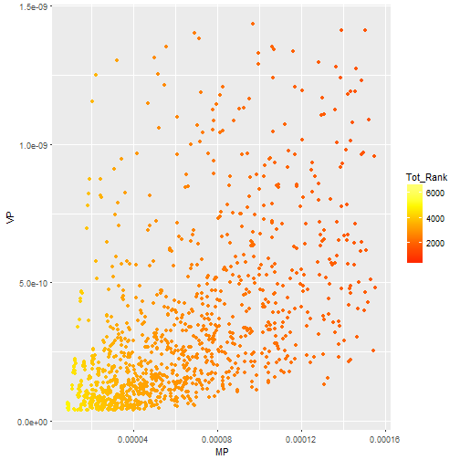
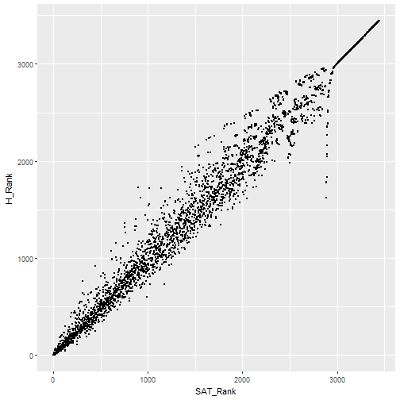

# Stoplist Analysis

## Setup


```r
library(dplyr)
library(ggplot2)
library(RColorBrewer)

Sys.setlocale(locale = "Chinese") #Choose Chinese
```

```
## [1] "LC_COLLATE=Chinese (Simplified)_People's Republic of China.936;LC_CTYPE=Chinese (Simplified)_People's Republic of China.936;LC_MONETARY=Chinese (Simplified)_People's Republic of China.936;LC_NUMERIC=C;LC_TIME=Chinese (Simplified)_People's Republic of China.936"
```

```r
source("C:/Users/Ania/Documents/Medycyna/Clinical School/Word count/Scripts/Helpful_Functions.R")

#coul = brewer.pal(4, "BuPu")
#coul = colorRampPalette(coul)
```


## Test case


```r
#N <- 3
#test <- data.frame(words = c("a", "b", "c", "a", "b", "b", "d"),
#                   freq = c(5, 3, 4, 2, 3, 8, 2), 
#                   doc = c(rep("i", 3), rep("ii", 2), rep("iii", 2)))


#test <- data.frame(words = c("a", "b", "c", "e", "a", "b", "b", "d"),
#                   freq = c(3, 5, 4, 1, 2, 3, 8, 2), 
#                   doc = c(rep("i", 4), rep("ii", 2), rep("iii", 2)))
```


## Data Preprocessing


```r
T <- readLines(con <- file("C:/Users/Ania/Documents/Medycyna/Clinical School/Word count/ogt_utf.txt", encoding = "UTF-8"))
#T <- readLines(con <- file("ogt_utf.txt", encoding = "UTF-8"))

N <- 10
Tp <- divideCharVector(T, N)
```

```
##  [1] 37047 45101 42835 43772 43144 47679 44919 43315 44702 39191
```

```r
counts_df <- data.frame()

#for (i in 1){
for (i in 1:N){
  c <- table(unlist(strsplit(Tp[[i]], split="")))
  c <- c[order(c, decreasing = TRUE)]
  c <- as.data.frame(c, stringsAsFactors = FALSE)
  c$doc <- i
  colnames(c) <- c("words", "freq", "doc")
  counts_df <- rbind(counts_df, c)
}


remove_char_groups <- c("[[:blank:]]","[[:punct:]]", "[[:digit:]]", "[A-z]")
weliminate_cont(remove_char_groups, counts_df$words[1:100])
```

```
##  [1] "¶Ã<U+00C4>" "<U+0147><U+00BB>" "®¢<U+00CB>" "<U+0118><U+00C7>" "<U+00CB><U+0171>" "<U+02DB><U+00BB>" "®¢<U+00D6>" "<U+00C7><U+0142>" "<U+00D4>®≤" "<U+00CB>y" "®Æ<U+0110>" "<U+010C><U+00CB>" "<U+00B8><U+00F6>" "<U+0150>a"
## [15] "°¡<U+0139>" "<U+0154>°‰" "®¶<U+010E>" "¶Ã<U+02DD>" "<U+013E>®™" "<U+017C>°‰" "<U+0147><U+02DB>" "°‰®Æ" "<U+010E><U+00C2>" "<U+00CE><U+0147>" "<U+00BB><U+0105>" "<U+0154><U+010F>" "<U+00D6><U+00AE>" "<U+010C><U+00BB>"
## [29] "¶Ã<U+0158>" "®™°§" "<U+00C4><U+0103>" "<U+0102>°‰" "¶Ã<U+0102>" "<U+0118><U+00D6>" "<U+00BB>®¢" "<U+0118>°¿" "<U+0154>°¬" "¶Ã®≤" "<U+00CB>¶Ã" "<U+0102><U+00BB>" "<U+00D6><U+00C2>" "<U+0105>y"
## [43] "<U+00C4><U+00C7>" "<U+013E>-" "<U+0142><U+010E>" "<U+00B6><U+013D>" "<U+0147><U+015E>" "°¡<U+00DF>" "<U+0105><U+00CB>" "<U+017C><U+015E>" "<U+015F>®Æ" "<U+0142><U+00F6>" "<U+00B6><U+0159>" "<U+015F>®π" "<U+015F><U+0102>" "<U+0102><U+00C7>"
## [57] "<U+00C7>°„" "<U+0143>®Æ" "°¡®Æ" "®ß®ß" "<U+010C><U+0104>" "<U+0110>|" "¶Ã<U+0103>" "®Æ<U+00D6>" "<U+0150><U+00C2>" "°‰<U+010F>" "°„<U+00AE>" "<U+0102><U+0139>" "<U+0102><U+0107>" "<U+0106><U+0111>"
## [71] "<U+00B6><U+00D4>" "<U+0154>®™" "®¶®™" "<U+0142>¶Ã" "®¶<U+016F>" "<U+00CE><U+015E>" "<U+0110><U+00C4>" "°§<U+02D8>" "<U+013E><U+02DB>" "®¶<U+00AB>" "<U+0105><U+00AB>" "<U+0118><U+00C2>" "°¡<U+00D4>" "¶Ã<U+0154>"
## [85] "<U+0143><U+0170>" "<U+0147>a" "<U+00D6><U+00BB>" "<U+00BB>°„" "<U+010E><U+00EB>" "<U+0147><U+0143>"
```

```r
print.listof(weliminate_cont(remove_char_groups, counts_df$words[1:100]), locale = locale(encoding = "UTF-8"))
```

```
## Component 1 :
## [1] "¶Ã<U+00C4>"
## 
## Component 2 :
## [1] "<U+0147><U+00BB>"
## 
## Component 3 :
## [1] "®¢<U+00CB>"
## 
## Component 4 :
## [1] "<U+0118><U+00C7>"
## 
## Component 5 :
## [1] "<U+00CB><U+0171>"
## 
## Component 6 :
## [1] "<U+02DB><U+00BB>"
## 
## Component 7 :
## [1] "®¢<U+00D6>"
## 
## Component 8 :
## [1] "<U+00C7><U+0142>"
## 
## Component 9 :
## [1] "<U+00D4>®≤"
## 
## Component 10 :
## [1] "<U+00CB>y"
## 
## Component 11 :
## [1] "®Æ<U+0110>"
## 
## Component 12 :
## [1] "<U+010C><U+00CB>"
## 
## Component 13 :
## [1] "<U+00B8><U+00F6>"
## 
## Component 14 :
## [1] "<U+0150>a"
## 
## Component 15 :
## [1] "°¡<U+0139>"
## 
## Component 16 :
## [1] "<U+0154>°‰"
## 
## Component 17 :
## [1] "®¶<U+010E>"
## 
## Component 18 :
## [1] "¶Ã<U+02DD>"
## 
## Component 19 :
## [1] "<U+013E>®™"
## 
## Component 20 :
## [1] "<U+017C>°‰"
## 
## Component 21 :
## [1] "<U+0147><U+02DB>"
## 
## Component 22 :
## [1] "°‰®Æ"
## 
## Component 23 :
## [1] "<U+010E><U+00C2>"
## 
## Component 24 :
## [1] "<U+00CE><U+0147>"
## 
## Component 25 :
## [1] "<U+00BB><U+0105>"
## 
## Component 26 :
## [1] "<U+0154><U+010F>"
## 
## Component 27 :
## [1] "<U+00D6><U+00AE>"
## 
## Component 28 :
## [1] "<U+010C><U+00BB>"
## 
## Component 29 :
## [1] "¶Ã<U+0158>"
## 
## Component 30 :
## [1] "®™°§"
## 
## Component 31 :
## [1] "<U+00C4><U+0103>"
## 
## Component 32 :
## [1] "<U+0102>°‰"
## 
## Component 33 :
## [1] "¶Ã<U+0102>"
## 
## Component 34 :
## [1] "<U+0118><U+00D6>"
## 
## Component 35 :
## [1] "<U+00BB>®¢"
## 
## Component 36 :
## [1] "<U+0118>°¿"
## 
## Component 37 :
## [1] "<U+0154>°¬"
## 
## Component 38 :
## [1] "¶Ã®≤"
## 
## Component 39 :
## [1] "<U+00CB>¶Ã"
## 
## Component 40 :
## [1] "<U+0102><U+00BB>"
## 
## Component 41 :
## [1] "<U+00D6><U+00C2>"
## 
## Component 42 :
## [1] "<U+0105>y"
## 
## Component 43 :
## [1] "<U+00C4><U+00C7>"
## 
## Component 44 :
## [1] "<U+013E>-"
## 
## Component 45 :
## [1] "<U+0142><U+010E>"
## 
## Component 46 :
## [1] "<U+00B6><U+013D>"
## 
## Component 47 :
## [1] "<U+0147><U+015E>"
## 
## Component 48 :
## [1] "°¡<U+00DF>"
## 
## Component 49 :
## [1] "<U+0105><U+00CB>"
## 
## Component 50 :
## [1] "<U+017C><U+015E>"
## 
## Component 51 :
## [1] "<U+015F>®Æ"
## 
## Component 52 :
## [1] "<U+0142><U+00F6>"
## 
## Component 53 :
## [1] "<U+00B6><U+0159>"
## 
## Component 54 :
## [1] "<U+015F>®π"
## 
## Component 55 :
## [1] "<U+015F><U+0102>"
## 
## Component 56 :
## [1] "<U+0102><U+00C7>"
## 
## Component 57 :
## [1] "<U+00C7>°„"
## 
## Component 58 :
## [1] "<U+0143>®Æ"
## 
## Component 59 :
## [1] "°¡®Æ"
## 
## Component 60 :
## [1] "®ß®ß"
## 
## Component 61 :
## [1] "<U+010C><U+0104>"
## 
## Component 62 :
## [1] "<U+0110>|"
## 
## Component 63 :
## [1] "¶Ã<U+0103>"
## 
## Component 64 :
## [1] "®Æ<U+00D6>"
## 
## Component 65 :
## [1] "<U+0150><U+00C2>"
## 
## Component 66 :
## [1] "°‰<U+010F>"
## 
## Component 67 :
## [1] "°„<U+00AE>"
## 
## Component 68 :
## [1] "<U+0102><U+0139>"
## 
## Component 69 :
## [1] "<U+0102><U+0107>"
## 
## Component 70 :
## [1] "<U+0106><U+0111>"
## 
## Component 71 :
## [1] "<U+00B6><U+00D4>"
## 
## Component 72 :
## [1] "<U+0154>®™"
## 
## Component 73 :
## [1] "®¶®™"
## 
## Component 74 :
## [1] "<U+0142>¶Ã"
## 
## Component 75 :
## [1] "®¶<U+016F>"
## 
## Component 76 :
## [1] "<U+00CE><U+015E>"
## 
## Component 77 :
## [1] "<U+0110><U+00C4>"
## 
## Component 78 :
## [1] "°§<U+02D8>"
## 
## Component 79 :
## [1] "<U+013E><U+02DB>"
## 
## Component 80 :
## [1] "®¶<U+00AB>"
## 
## Component 81 :
## [1] "<U+0105><U+00AB>"
## 
## Component 82 :
## [1] "<U+0118><U+00C2>"
## 
## Component 83 :
## [1] "°¡<U+00D4>"
## 
## Component 84 :
## [1] "¶Ã<U+0154>"
## 
## Component 85 :
## [1] "<U+0143><U+0170>"
## 
## Component 86 :
## [1] "<U+0147>a"
## 
## Component 87 :
## [1] "<U+00D6><U+00BB>"
## 
## Component 88 :
## [1] "<U+00BB>°„"
## 
## Component 89 :
## [1] "<U+010E><U+00EB>"
## 
## Component 90 :
## [1] "<U+0147><U+0143>"
```

```r
print("ó˙í†í¶ônìç")
```

```
## [1] "°™®≤°Ø<U+00A0>°Ø|<U+2122>n°∞<U+0164>"
```

```r
counts_df <- counts_df[weliminate(remove_char_groups, counts_df$words),]

test <- counts_df

ggplot(subset(counts_df, freq>180), aes(x = reorder(words, -freq), y = freq)) +
  geom_bar(stat = "identity") + 
  theme(axis.text.x=element_text(angle=45, hjust=1)) + coord_fixed(ratio = 1/600 )
```



```r
ggsave(filename = "counts_df_above140_freq.png", height = 8, width = 16)
```


## Calculations


```r
#Calculate Doc_size (sum freq within a doc)
test <- test %>% group_by(doc) %>% mutate(Doc_size = sum(freq))

#Calculate Prob_word_in_doc (freq/Doc_size)
test <- test %>% group_by(words) %>% mutate(Prob_word_in_doc = freq/Doc_size)

#Calculate MP ((sum of prob)/N)
test <- test %>% group_by(words) %>% mutate(MP = sum(Prob_word_in_doc)/N)

#Calculate Variance (divided by the number of documents)
test <- test %>% group_by(words) %>% mutate(VP = var(Prob_word_in_doc)/N)

#Calculate SAT
#test <- mutate(test, SAT = MP/VP) #Does not work very well
#test <- mutate(test, SAT = MP/(VP^0.5))
test <- mutate(test, SAT = MP*(VP^0.5))

#Calculate Entropy (in two steps)
#test <- mutate(test, H_int = -(Prob_word_in_doc * log(Prob_word_in_doc, base = 2)))
#test <- test %>% group_by(words) %>% mutate(H2 = sum(H_int))

#Calculate Entropy
test <- test %>% group_by(words) %>% mutate(H = sum(-Prob_word_in_doc * log(Prob_word_in_doc, base = 2)))


test_sum <- test %>% select(words, MP, VP, SAT, H)

test_sum <- distinct(test_sum)

if (dim(test_sum)[1]!=(length(unique(test_sum$words)))){
  stop("Something went wrong in the processing")
}

test_sum <- test_sum %>% mutate(SAT=replace(SAT, is.na(SAT), 0))

test_sum <- as.data.frame(test_sum) #Seems to be necessary
test_sum <- test_sum %>% arrange(desc(SAT), desc(MP)) %>% mutate(SAT_Rank = row_number())

#Some hopeless attempts
#test_sum <- as.data.frame(test_sum) #Seems to be necessary
#test_sum <- test_sum %>% mutate(SAT_Rank = dense_rank(c(SAT, MP)) )

#max_SAT_Rank <- max(test_sum$SAT_Rank)
#test_sum <- test_sum %>% mutate(SAT2 = case_when(is.na(SAT) ~ dense_rank(desc(MP))))

#test_sum <- test_sum %>% mutate(SAT3 = dense_rank(interaction(SAT, MP)))

test_sum <- as.data.frame(test_sum)
#test_sum <- test_sum %>% mutate(H_Rank = dense_rank(desc(H)))
test_sum <- test_sum %>% mutate(H_Rank = row_number(desc(H)))


test_sum <- test_sum %>% mutate(Tot_Rank = SAT_Rank+ H_Rank)

test_sum <- test_sum %>% arrange(Tot_Rank)
```

A note on ordering:

- decreasing entropy (stopwords have highest entropy)
- decreasing SAT_Rank (stopwords have high MP and low VP)
NOTE: in case of the same SAT values, MP is taken into account


## Visualisation


```r
MP_1q <- summary(test_sum$MP)[2]
MP_3q <- summary(test_sum$MP)[5]
VP_1q <- summary(test_sum$VP)[2]
VP_3q <- summary(test_sum$VP)[5]

ggplot(test_sum, aes(x = MP, y = VP)) + geom_point(aes(fill = H))
```

```
## Warning: Removed 554 rows containing missing values (geom_point).
```



```r
ggplot(test_sum, aes(x = MP, y = VP)) + geom_point(aes(col = H)) + ylim(c(VP_1q, VP_3q)) + xlim(c(MP_1q, MP_3q))+ scale_colour_gradientn(colors = terrain.colors(100))
```

```
## Warning: Removed 2215 rows containing missing values (geom_point).
```



```r
ggplot(test_sum, aes(x = MP, y = VP)) + geom_point(aes(col = Tot_Rank)) + ylim(c(VP_1q, VP_3q)) + xlim(c(MP_1q, MP_3q)) + scale_colour_gradientn(colors = heat.colors(5))
```

```
## Warning: Removed 2215 rows containing missing values (geom_point).
```



```r
#heat.colors is a palette from grDevices


ggplot(test_sum, aes(x = SAT_Rank, y = H_Rank)) + geom_point(size = 0.02)
```



```r
ggplot(test_sum, aes(x = SAT_Rank, y = H_Rank)) + geom_point(size = 0.02, aes(col = MP)) + scale_color_gradient(low = "green", high = "red")
```



```r
myPalette <- colorRampPalette(rev(brewer.pal(11, "Spectral")))
sc <- scale_colour_gradientn(colours = myPalette(100), limits=c(0, 0.001))


ggplot(test_sum, aes(x = SAT_Rank, y = H_Rank)) + geom_point(size = 0.02, aes(col = MP)) + sc
```



